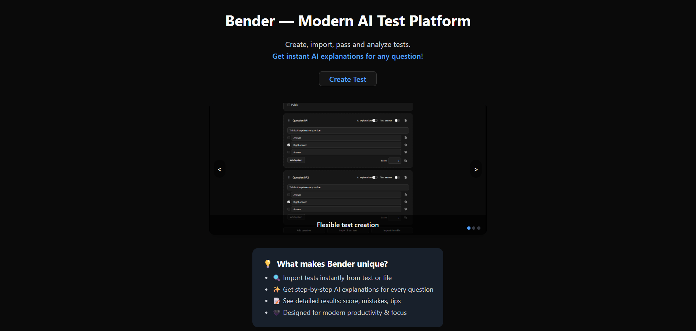
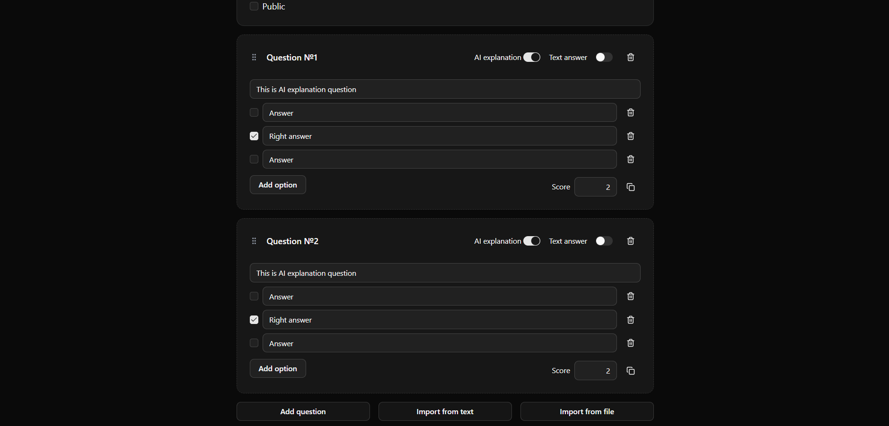
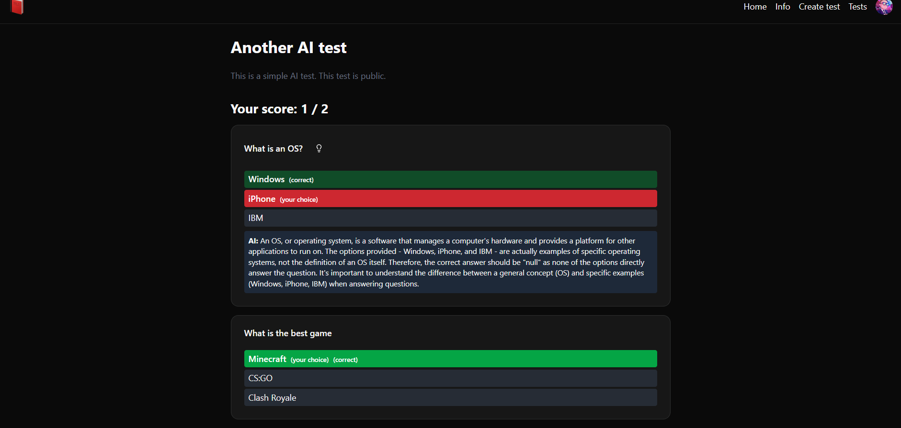

# Bender — AI-powered Testing Platform

Bender is a platform for creating, importing, passing, and analyzing quizzes with instant AI explanations for question.

---



## 🚀 Features

- **Create** quizzes from scratch, text, or file import.
- **Flexible question builder:** AI-explanation toggle, text answers, score weighting.
- **Instant AI explanations:** click the 💡 icon after the test to get an explanation.
- **Beautiful results:** see your score, correct/incorrect answers, and AI feedback.
- **Secure authentication:** JWT, Google OAuth.
- **Modern UI:** responsive, dark-themed, productivity-focused.

---

## 🖥️ Stack

- **Backend:** Spring Boot, PostgreSQL, JWT, OAuth2
- **Frontend:** React + Tailwind + shadcn/ui
- **AI Integration:** OpenAI API (for explanations)
- **Python Services:** FastAPI microservices for NLP (KeyBERT etc.)

---

## 🏁 Quick Start

### 1. Clone the repo

```bash
git clone https://github.com/your-username/quizly.git
cd quizly
````

---

### 2. Backend (Spring Boot)

* **Requirements:** Java 17+, PostgreSQL
* **Config:**
  Всі чутливі дані — через `application.properties` або змінні середовища:

```properties
spring.datasource.url=jdbc:postgresql://localhost:5432/quizly
spring.datasource.username=your_db_user
spring.datasource.password=your_db_password

jwt.secret=your_jwt_secret

google.clientId=your-google-oauth-client-id.apps.googleusercontent.com

openai.api.key=sk-xxxxxx

app.cors.allowedOrigins=http://localhost:5173
```

* **Run:**

```bash
./gradlew bootRun
```

* **Swagger:** [http://localhost:8080/swagger-ui/index.html](http://localhost:8080/swagger-ui/index.html)

---

### 3. Python Services

**Each service (example: `keyword-api`, `semantic-api`)**

```bash
cd keyword-api
python3 -m venv .venv
source .venv/bin/activate
pip install -r requirements.txt
uvicorn main:app --reload --port 8001
```

---

### 4. Frontend

* (`npm install` + `npm run dev`)

---

## 🔑 Environment variables

* **Spring Boot: ** via `application.properties` or env vars
* **Python: ** create `.env` if needed


---

## 📄 API Documentation

Available here `/swagger-ui/index.html` (run backend).

---

## 🖼️ Screenshots


*Flexible test builder with AI and import support.*


*Detailed results page — see mistakes, get explanations instantly.*

---

*Built by Maksym Tkach, 2025*

````
